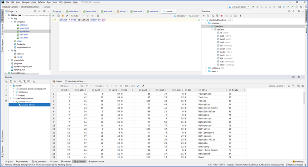
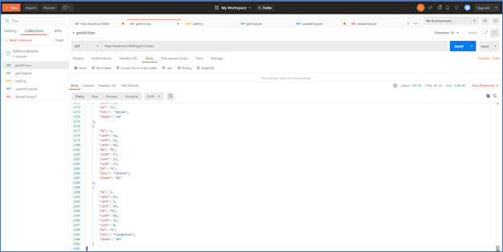
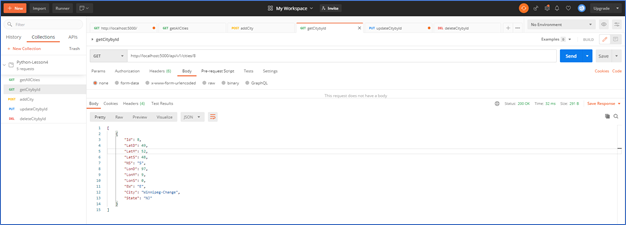
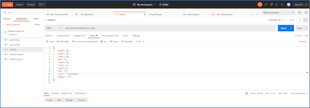
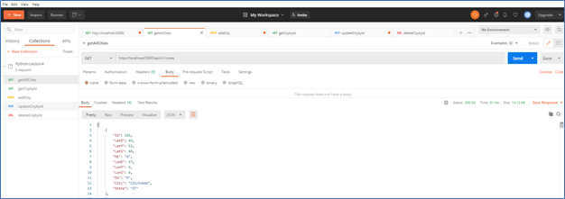
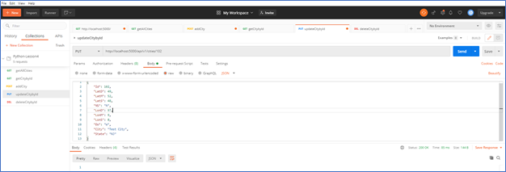
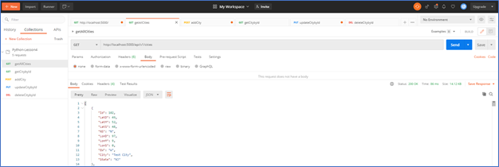
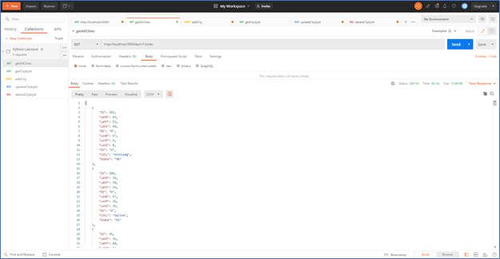
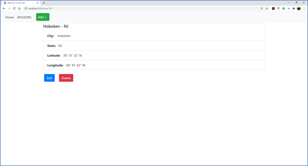

Operation: getAllCities

Method: GET

Operation: getCitybyId

Method: GET

Operation: addCity

Method: POST

Operation: updateCitybyId

Method: PUT

Operation: deleteCitybyId

Method: DELETE

