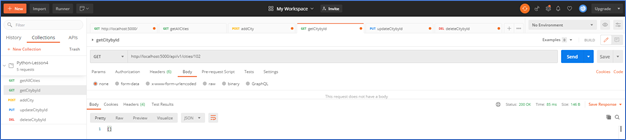

## Lesson 3 Homework 11/24/20 -- Nayana Kumari Thakur

a.  The project showing view data tables in pycharm:

b.  Project running correctly in the browser displaying 
    homepage with data:

c.  Project running correctly in the browser displaying 
    data record as a view of one record

Following can be seen upon clicking the number link 7:

d.  Project running correctly in the browser displaying a new
    record added to home page:

The add screen is displayed upon clicking the Add+ button on Navbar

Record added with Id: 101

e. Project running correctly in the browser displaying an
updated record added to homepage:

Following screen is displayed upon clicking the Edit button on view
screen

Record Id: 101 updated.

f. Project running correctly in the browser displaying a
deleted record added to homepage:

Record ID: 101 is deleted after clicking on Delete button on view
screen.

